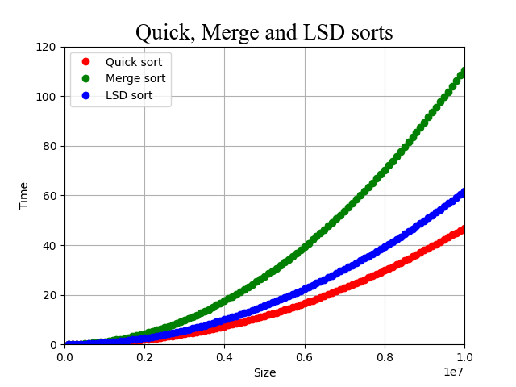

# **Практическая работа №3**

В данной работе представлена реализация самых известных алгоритмов сортировки:

* Insertion sort
* Bubble sort
* Selection sort
* Quick sort
* Merge sort
* LSD sort

Целью исследования является сравнение скорости работы этих алгоритмов.

## **Описание**

В файле [sorts.cpp](https://github.com/DavidChibukhchian/Algorithms/tree/main/Prac3/source/sorts.cpp) вы найдёте реализацию каждого алгоритма.

Квадратичные сортировки (Insertion, Bubble, Selection sort) тестировались параллельно друг другу, на одних и тех же массивах. Исходный код теста вы найдёте в файле [test_quick_or_quadratic_sorts.cpp](https://github.com/DavidChibukhchian/Algorithms/tree/main/Prac3/source/test_quick_or_quadratic_sorts.cpp).

В работе представлены три варианта быстрой сортировки (Quick sort), которые отличаются стратегиями выбора [опорного элемента](https://github.com/DavidChibukhchian/Algorithms/blob/main/Prac3/source/sorts.h#L29) (pivot).

Тесты быстрой сортировки проводились по шаблону, который использовался для исследования квадратичных сортировок. В исходном коде теста были изменены лишь названия файлов и область тестирования.

Далее были проведены тесты для сортировки слиянием (Merge sort) и поразрядной сортировки (LSD sort). Исходный код тестов вы найдёте в файлах [test_merge_sort.cpp](https://github.com/DavidChibukhchian/Algorithms/tree/main/Prac3/source/test_merge_sort.cpp) и [test_LSD_sort.cpp](https://github.com/DavidChibukhchian/Algorithms/tree/main/Prac3/source/test_LSD_sort.cpp).

На данном графике представлены три самых быстрых алгоритма из нашего списка. Здесь в качестве быстрой сортировки была использована быстрая сортировка с выбором центрального элемента как опорного (pivot_Central).

## **Примечания**

Исполняемые файлы для проведения тестов создаются командами

* `make test_three_sort_functions`
* `make test_merge_sort`
* `make test_LSD_sort`

В папке [results](https://github.com/DavidChibukhchian/Algorithms/tree/main/Prac3/results) вы найдёте результаты проведения тестов для каждого алгоритма сортировки.

Для построения графиков используется язык Python и библиотека matplotlib. Графики и исходный код программы на Python вы найдёте в папке [python_plots](https://github.com/DavidChibukhchian/Algorithms/tree/main/Prac3/python_plots).

## **Вывод**

Квадратичные сортировки, конечно, работают медленно. Но они лучше остальных подходят для образовательных целей в силу простоты реализации.

Из представленных сортировок самой быстрой оказалась быстрая сортировка (Quick sort).